# Lab 6 - Feature Matching and Classification
*Yujeong Seo, Gabriela Lee, 20 March 2026*

This laboratory session is designed to support the contents of Lectures 10 and 11 of the module.  

## Task 1: Image resizing

The following image is the famous painting by van Gogh called 'Cafe Terrace at Night', which can be found in the file *_'cafe_van_gogh.jpg'_* in the _'assets'_ folder.  

<p align="center"> 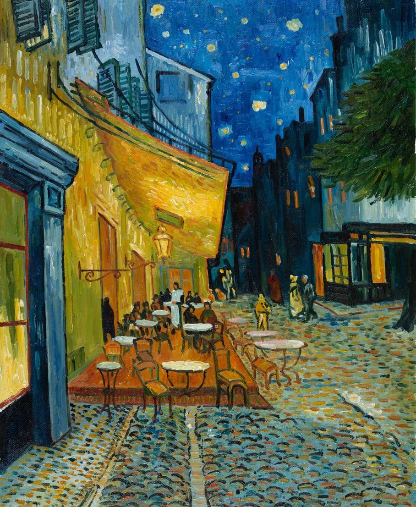 </p>

>Write a Matlab program to read this file and build the image pyramid by resize the image by a factor of 1/2, 1/4, 1/8, 1/16 and 1/32 by drop every other rows and columns.  Then display all six images as a montage of size [2 3]. 

```matlab
f1 = f0(1:2:end,1:2:end,:);
```

**_The Matlab syntax `start:increment:end` is used to slice the rows and columns of an image. `1:2:end` used above samples every other pixel, returning indices 1, 3, 5, 7, ..., up to the last row or column, halving the resolution. A image by a factor of 1/2, 1/4, 1/8, 1/16 and 1/32 is created by applying the method iteratively to each resulting image._**

<p align="center"> 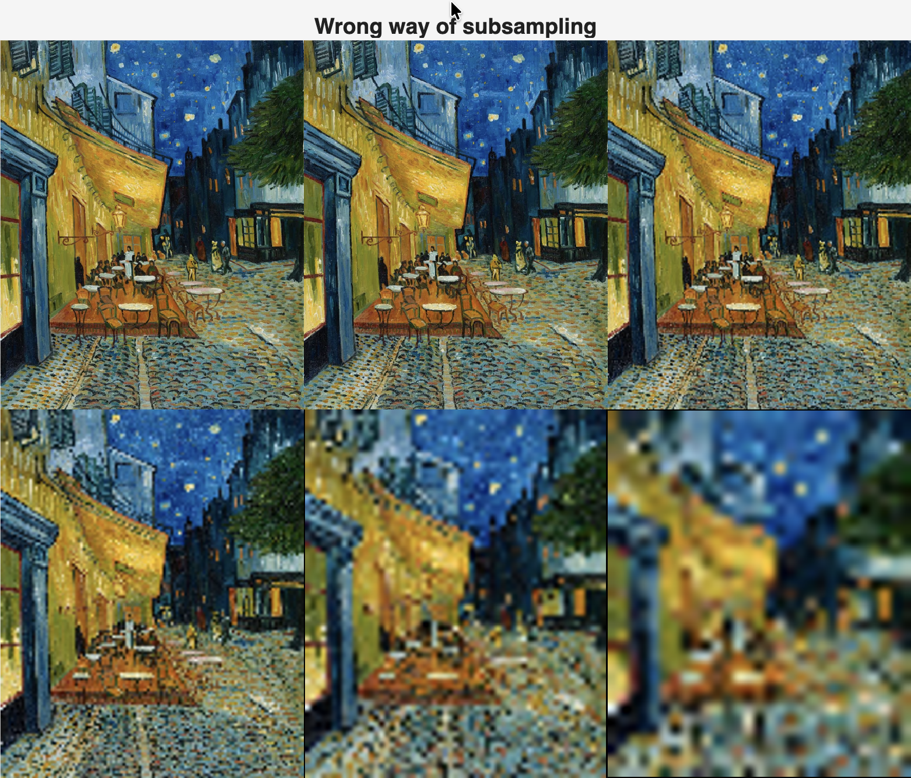 </p>

>Repeat the above exercise by adding code to properly resize the image with the **_imresize_** function.

```matlab
f_1 = imresize(f0, 0.5);
```

**_Matlab function `imresize(I, scale)` properly resizes an input image `I` by specified `scale` factor. This function first applies a lowpass Gaussian filter to remove the high frequency components before subsampling. A scale factor of `0.5` corresponds to reducing the image dimension by a factor of 2._**

<p align="center">  </p>

>Compare the results from the two approach to subsampling.

**_First method, by dropping the every other pixel, introduces artifacts and patterns that are not preesent in the original image. This is a consequence of aliasing as high-frequency content is not removed._**

**_The second method addresses this issue by applying a Gaussian lowpass filter before subsampling. By eliminating high-frequency components that could cause artifacts, the subsampling accurately produces a downscaled image._**


## Task 2: Pattern Matching with Normalized Cross Correlation

In this task, we will examine how to use Matlab's normalized cross correlation (NCC) function **_normxcorr2( )_** to match a template in file *_'assets/template1.tif'_* to that of the image _'salvador_grayscale.tif'_.

The following code will compute the NCC function and plot it as a 3D plot:

```matlab
f = imread('assets/salvador_grayscale.tif');
w = imread('assets/template1.tif');
c = normxcorr2(w, f);
figure(1)
surf(c)
shading interp
```

>Try this code and explore the NCC plot between the template and the image. You should be able manually locate the position of the template from the plot. This will be the location where the normalized cross correlation value = 1.0, i.e. an exact match.

<p align="center"> 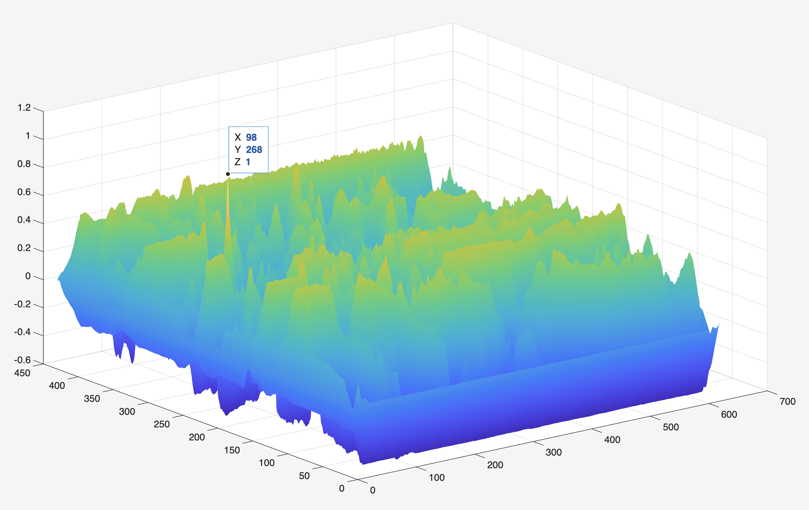 </p>

**_The peak location is manually identified from the plot: correlation value of 1.0 at coordinates X = 98, Y = 268._**


Now we want to detect the peak location automatically. This is achieve with:

```matlab
[ypeak, xpeak] = find(c==max(c(:)));
yoffSet = ypeak-size(w,1);
xoffSet = xpeak-size(w,2);
figure(2)
imshow(f)
drawrectangle(gca,'Position', ...
    [xoffSet,yoffSet,size(w,2),size(w,1)], 'FaceAlpha',0);
```

>Find out for yourself what the Matlab function **_find( )_** does.  Comment on the results.

<p align="center"> 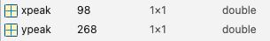 </p>
<p align="center"> 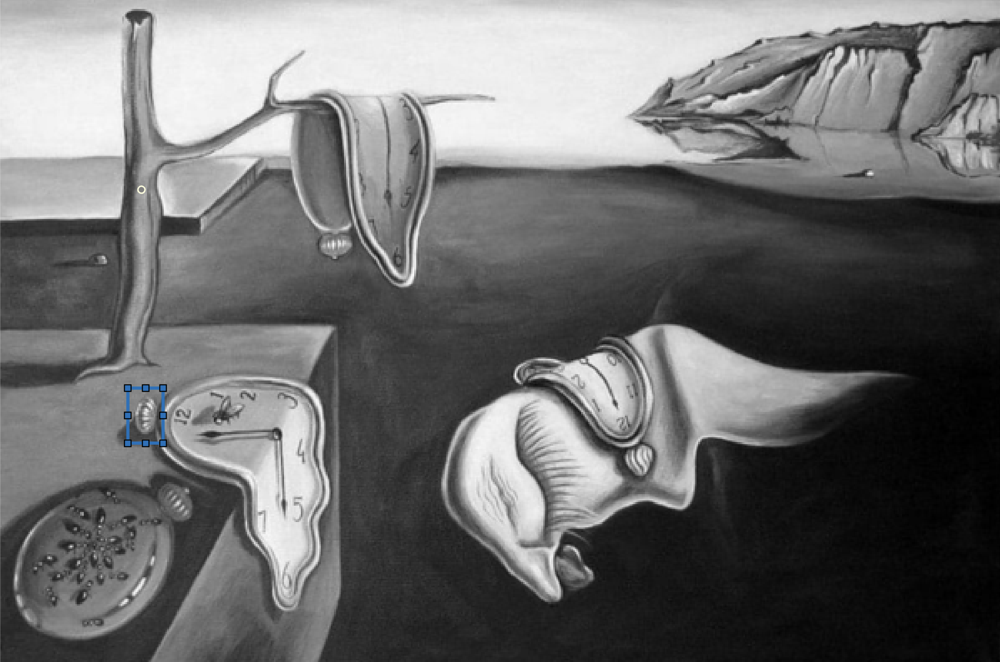 </p>


**_`find()` returns the coordinate location (row and column) of the maximum value in the 2D correlation matrix `c`. Specifically, `max(c(:))` finds the global maximum in the matrix, and `c == max(c(:))` logic compares the element of `c` to identify where the peak exists. As shown in the variable window, the automatically detected coordinate `xpeak` and `ypeak` corresponds to the manual inspection from NCC plot._**  

**_Using the template dimensions, `yOffset` and `xOffset` maps the detected peak to the correct spatial location in the original image, bounding with rectangle._**

>Test this procedure again with the second template image **_'template2.tif'_**.

<p align="center"> 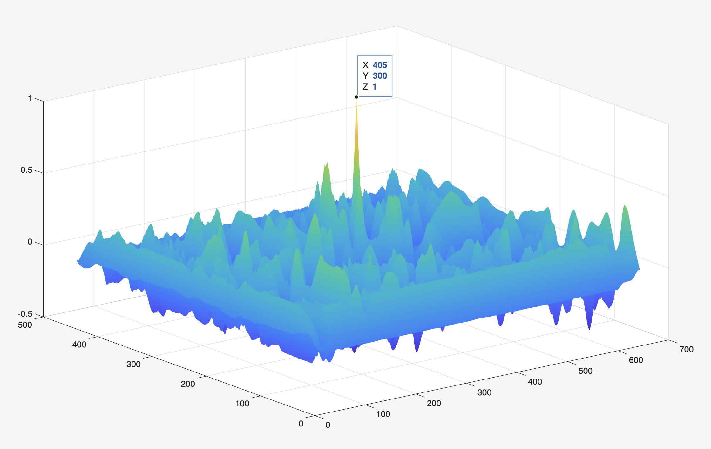 </p>
<p align="center">  </p>
<p align="center"> 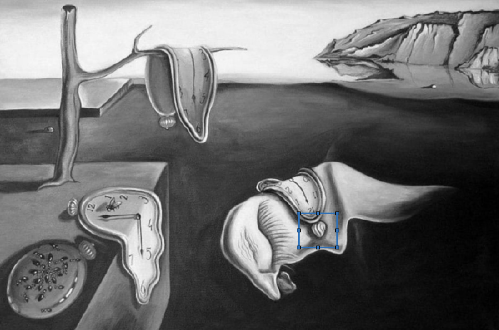 </p>

**_Same result for the template 2. However, this result highlights that NCC fails to detect other watch crowns with different sizes and orientation. NCC can only match a template to an image if the match is exact or nearly exact._**


## Task 3: SIFT Feature Detection

Let us now try to apply the SIFT detector provided by Matlab through the function **_detectSIFTFeastures( )_** on the Dali painting that we used in task 1.

```matlab
I = imread('assets/salvador.jpg');
f = im2gray(I);
points = detectSIFTFeatures(f);
figure(1); imshow(I);
hold on;
plot(points.selectStrongest(100));
```
>Comment on the results.
>Explore and explain the contents of the data structure *_points_*. 

<p align="center"> 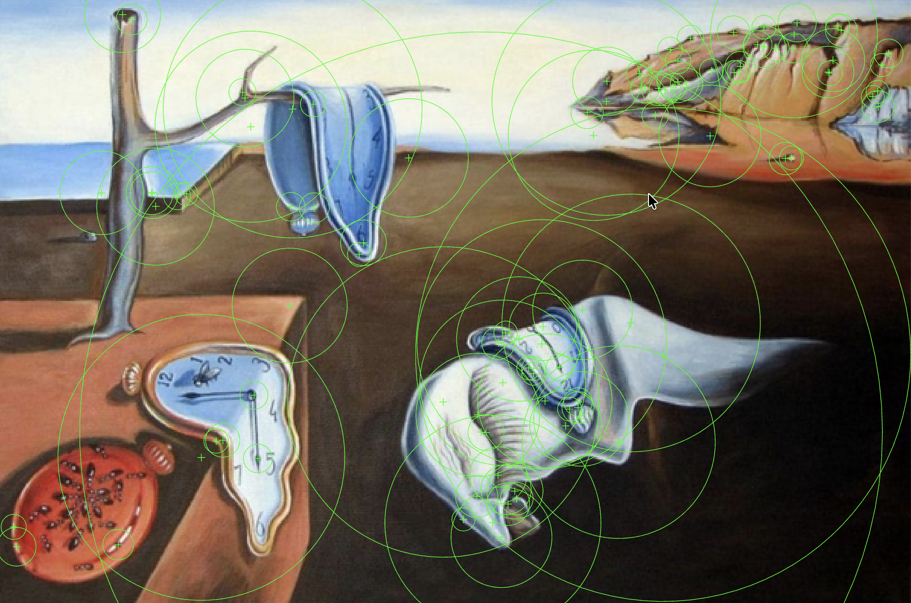 </p>
<p align="center"> 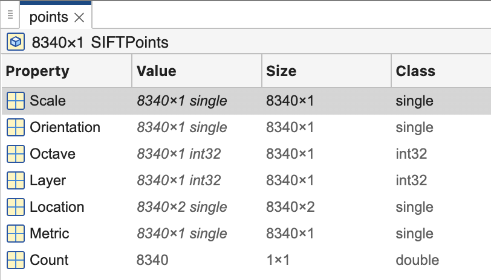 </p>

**_`points` contains the SIFT points objects, as a result of `detectSIFTFeatures`: all detected keypoints across the image. Shown in the second image, the `points` object contain entry that describes the keypoint: `Scale`, `Orientation`, `Location`, `Metric`, and more. From here, the `Metric` field indicates the feature strength. It uses the contrast threshold to determine the strength._**  

**_Based on the `Metric`, the line `points.selectStrongest(100)` ranks all detected keypoints and retains only top 100, strongest keypoints._** 

You may want to consult this [Matlab page](https://uk.mathworks.com/help/vision/ref/siftpoints.html) about SIFT Interesting Points.

>Find the SIFT points for the image **_'cafe_van_gogh.jpg'_**.
>
> Explore other methods of feature detection provided by Matlab provided in their toolboxes.

<p align="center"> 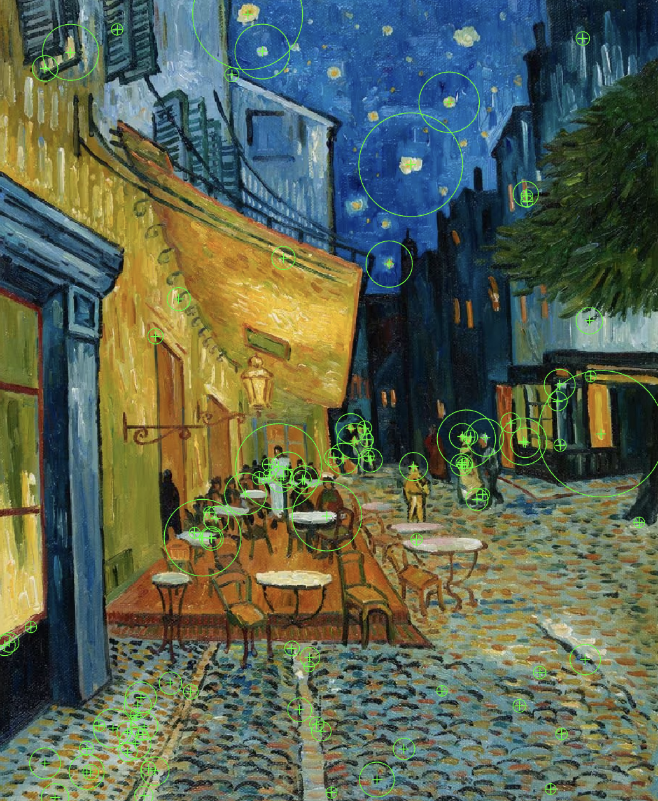 </p>


## Task 4: SIFT matching

We will now use SIFT features from two different scales of the same van Gogh painting to see how well SIFT manage to match the features that are of different scales (or sizes).

Run the following Matlab script:

```
clear all; close all;
I1 = imread('assets/cafe_van_gogh.jpg');
I2 = imresize(I1, 0.5);
f1 = im2gray(I1);
f2 = im2gray(I2);
points1 = detectSIFTFeatures(f1);
points2 = detectSIFTFeatures(f2);
Nbest = 100;
bestFeatures1 = points1.selectStrongest(Nbest);
bestFeatures2 = points2.selectStrongest(Nbest);
figure(1); imshow(I1);
hold on;
plot(bestFeatures1);
hold off;
figure(2); imshow(I2);
hold on;
plot(bestFeatures2);
hold off;
```

The code above finds the _Nbest_ features using SIFT in each image and overlay the features as circles onto the image.

>How successful do you think SIFT has managed to detect features for these two images (one is a quarter of the size of the other)?  What conclusions can you make?

| Original Image (I1)   | Downscaled Image (I2) | 
| :---:                 | :---:                 |
| 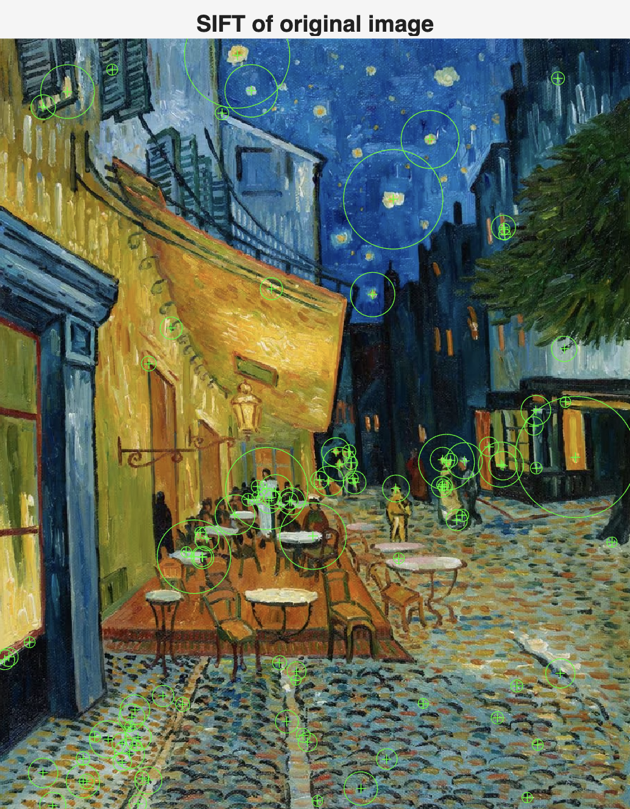|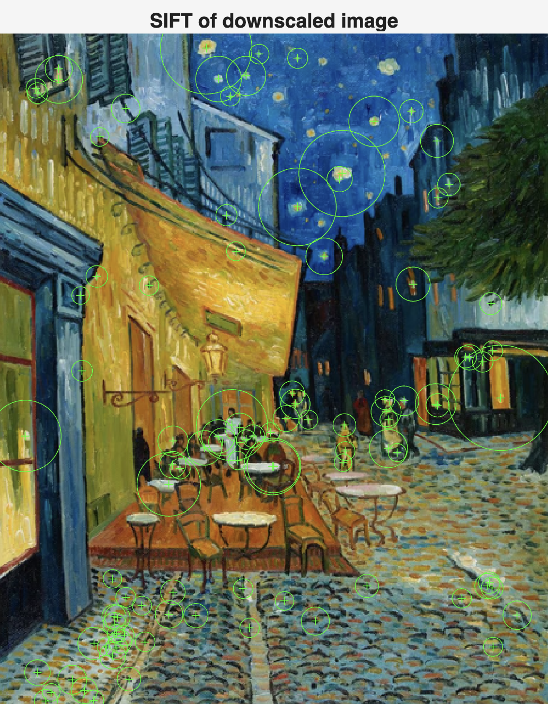|

**_The SIFT detected feature of downscaled image appears to be more visually significant keypoints. This is likely becuase downscaling reduces small, low-contrast details. As a result, weaker keypoints from the original images would have been suppressed, leaving more significant features._**

**_Still, there are significnat match between SIFT features of two images. The match between two images are mostly larger, more prominent blob-like elements. The difference in features that are affected by scaling are the smaller, finer keypoints. This similarity supports the scale invariance of SIFT._**


## Task 4: SIFT matching - scale and rotation invariance

The arrays *_points1_* and *_points2_* contains the interest points in the two images.  We now want to match the best *_Nbest_* points between the two sets. This is achieved as below:

```
[features1, valid_points1] = extractFeatures(f1, points1);
[features2, valid_points2] = extractFeatures(f2, points2);

 indexPairs = matchFeatures(features1, features2, 'Unique', true);

 matchedPoints1 = valid_points1(indexPairs(:,1),:);
 matchedPoints2 = valid_points2(indexPairs(:,2),:);
 figure(3);
 showMatchedFeatures(f1,f2,matchedPoints1,matchedPoints2);
```

Comment on the results.

<p align="center"> 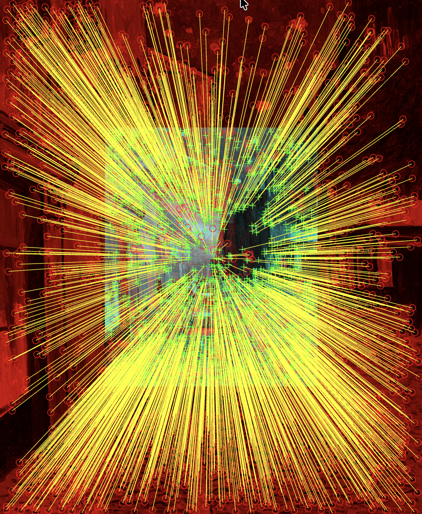 </p>

**_`matchFeatures` match all detected keypoints from each image. The matching lines appear to radiate outward from a central point, reflecting the geometric relationship of scales images._**


Now replace:
```
[features1, valid_points1] = extractFeatures(f1, points1);
```
with:
```
[features1, valid_points1] = extractFeatures(f1, bestFeatures1);
```
Comment on the results.

<p align="center"> 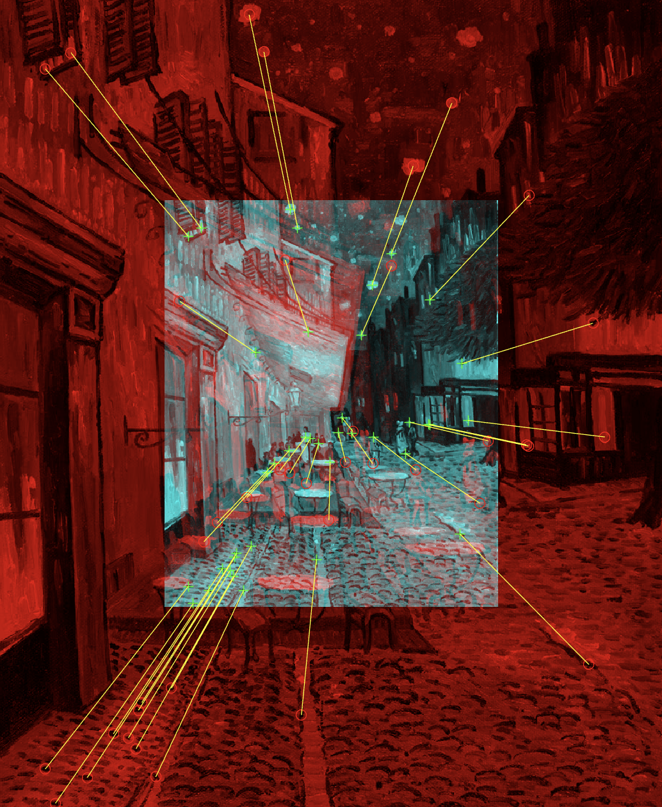 </p>

**_By restricting the points to best features, the corresponding points seem more clear and interpretable. With fewer keypoints, it is explicit how SIFT keypoints are consistent in both images across scale changes._**


>Next, rotate the smaller image by 20 degrees using the Matlab function **_imrotate( )_** and show that indeed SIFT is rotation invariant.

<p align="center"> 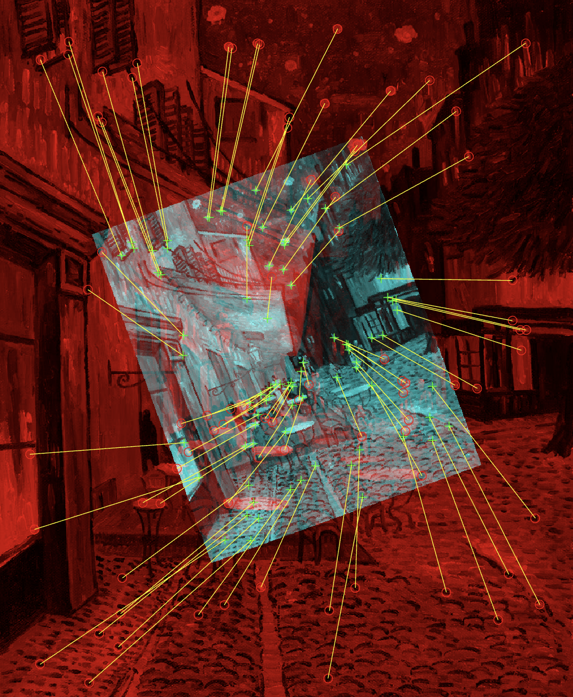 </p>

**_Matching the SIFT points with image yields similar successful correspondence in detected features. This demonstrates that SIFT is also rotation invariant._**


## Task 5: SIFT vs SURF

In addition to SIFT, there are other subsequently developed methods to detect features. These include:
* SURF
* KAZE
* BRISK
and others.  You will find these methods listed [here](https://uk.mathworks.com/help/vision/ug/local-feature-detection-and-extraction.html).

Let us now try to match two images from a video sequence of motorway traffic wtih cars moving bewteen frames.  The two still images are stored as *_'traffic_1.jpg'_* and *_'traffic_2.jpg'_*.  

>Use the same program in Task 4 to find the matching points between these two frames using SIFT. Comment on the results.
>
>Now change the algorithm from SIFT to SURF, and see what the differences in the results.

<p align="center"> 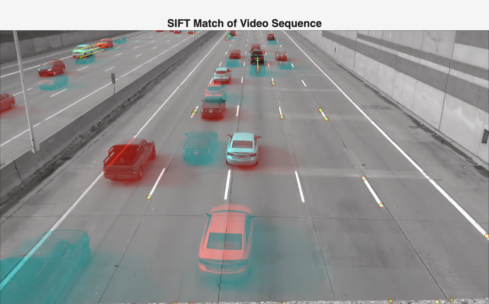 </p>
<p align="center">  </p>

**_While both SIFT and SURF are designed to be scale and rotation invariant, SURF seems to product noticeably better result than SIFT._**

**_From the first image, SIFT mostly matched static and high-contrast featuers such as road markings and background structures. Few moving objects like cars are matched but much lower than that of SURF._** 

**_On the other hand, SURF successfully matched the features of moving cars in successive video frames. This is interpretable by the vertical lines that connects the blobs in the direction of car moving._** 

**_The result is likely due to high contrast nature of the video background, and the result might be different in different scenes._**


## Task 6: Image recognition using neural networks

This task requires you to install a number of packages on Matlab beyond what you already have on your system.  You will be using either your laptop camera or, if you use an iPhone, use the camera on the iPhone.  For this task, you will need to install the camera support package for your machine (either Mac or PC).  You will also need to install the specific neural network model (e.g. AlexNet) onto your machines.

Enter the following:
```
% Lab 6 Task 6 
% Object recognition using webcam and various neural network models

camera = webcam;                            % create camera object for webcam
net = google;                               % change this for other networks
inputSize = net.Layers(1).InputSize(1:2);   % find neural network input size
figure 
I = snapshot(camera);      
image(I);
f = imresize(I, inputSize);                 % resize image to match network
tic;                                        % mark start time
[label, score] = classify(net,f);           % classify f with neural network net
toc                                         % report elapsed time
title({char(label), num2str(max(score),2)}); % label object
```

> Use the webcam to try to recognize different objects.  Also try to find the accuracy and speed of recogniture for different networks.

**_Example outputs from the webcam detection:_**
<p align="center"> 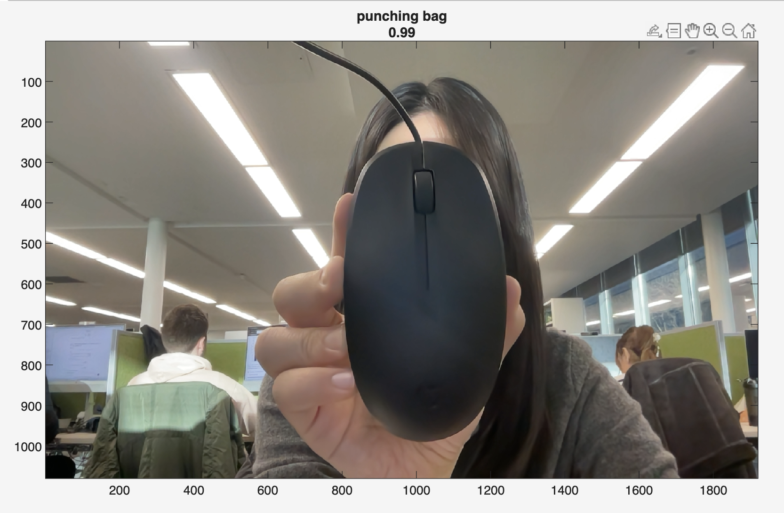 </p>
<p align="center"> 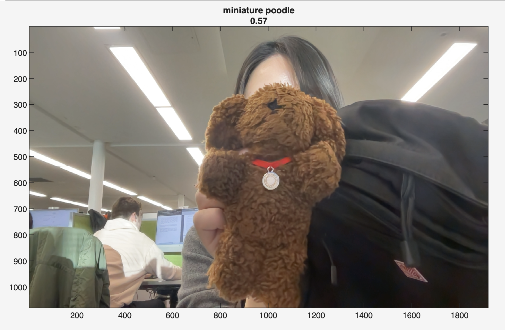 </p>
<p align="center"> 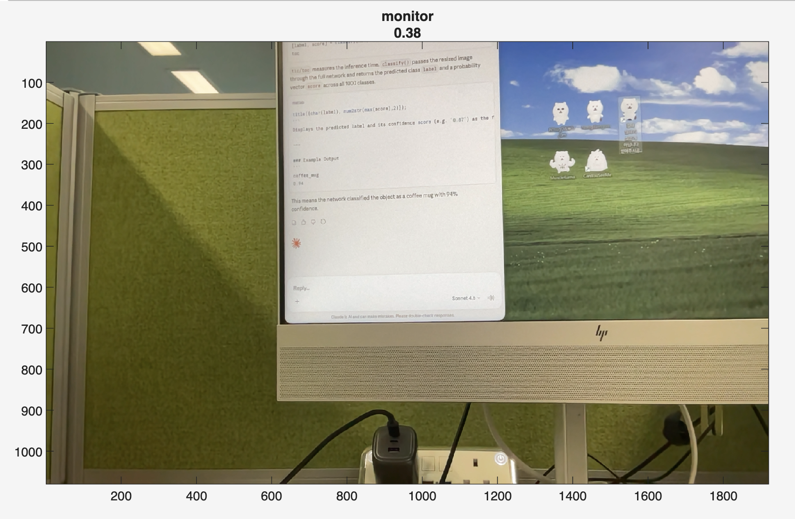 </p>

> Modify this code so that you capture and recognize object in a continous loop.

<p align="center"> 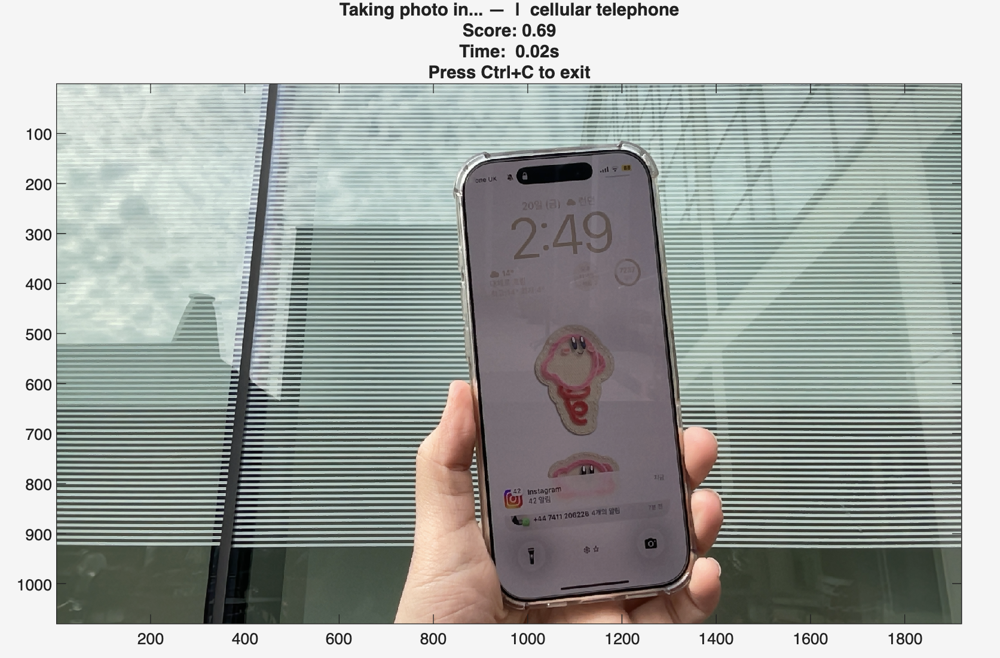 </p>

For continuous loop, `while true` loop is applied with `pause(1.5)` time constraint to allow reasonable time to check the classification result before the next frame is captures and processed.


You may also want to read and explore these online documents that accompany Matlab:

[Deep learning in Matlab](https://uk.mathworks.com/help/deeplearning/ug/deep-learning-in-matlab.html)

[Pretrained CNN](https://uk.mathworks.com/help/deeplearning/ug/pretrained-convolutional-neural-networks.html)
