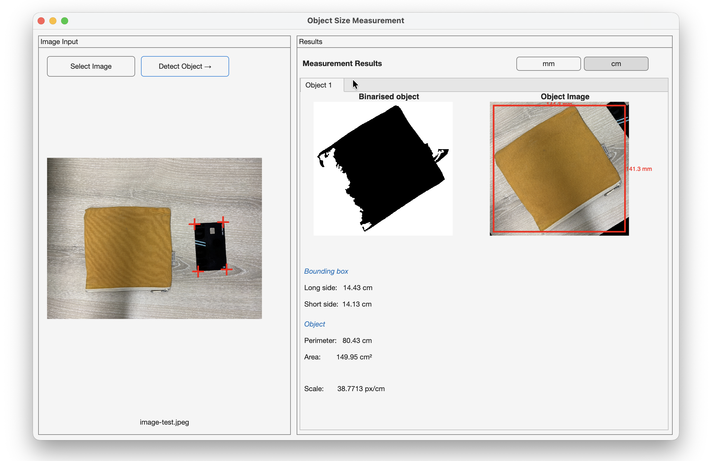
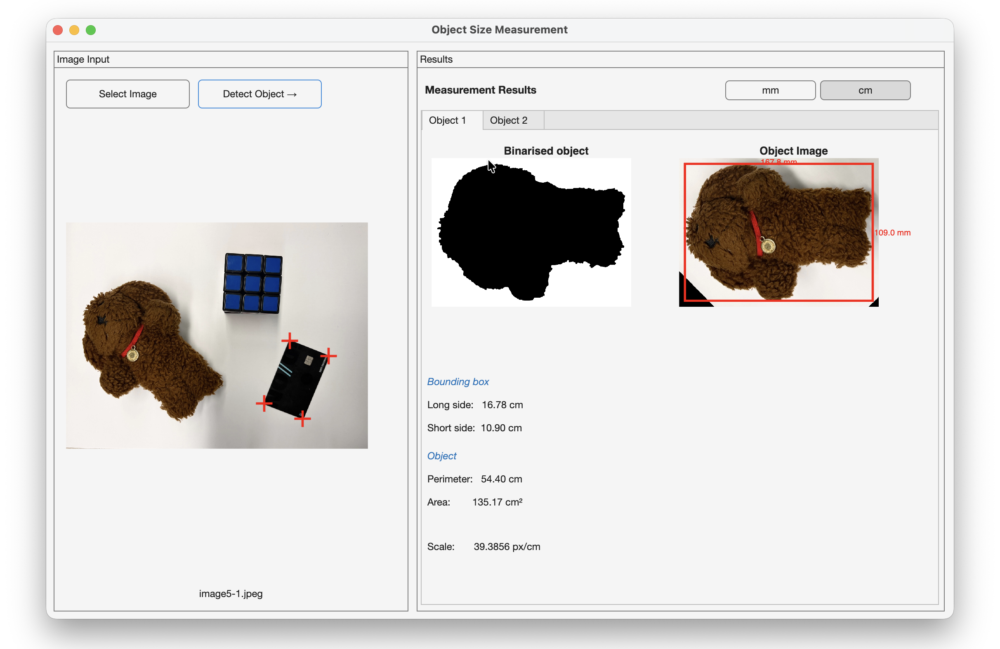
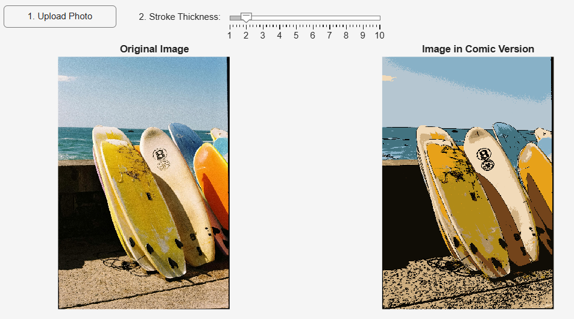
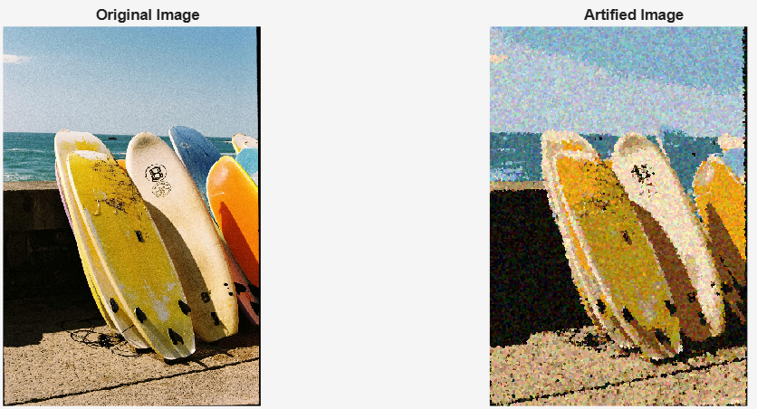
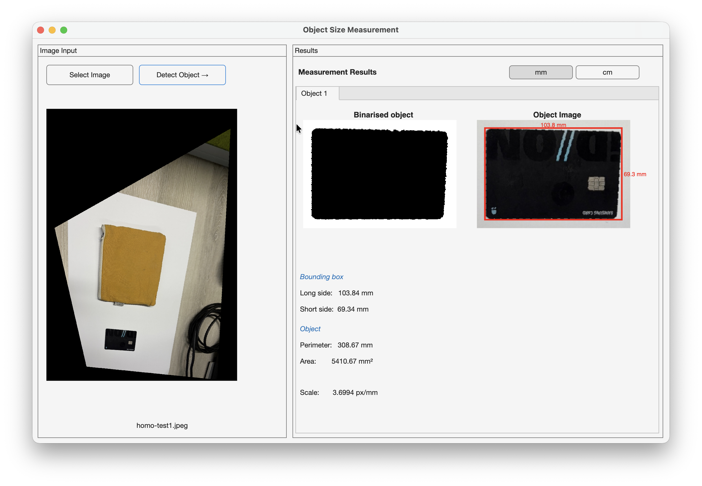
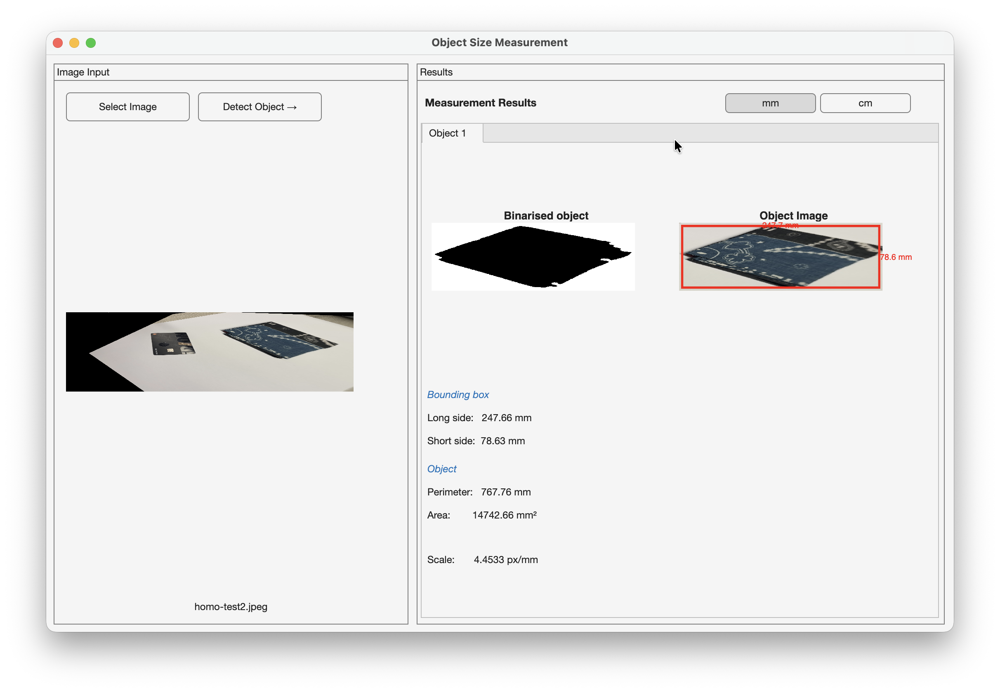

# Design of Visual Systems - Final Project
*Yujeong Seo, Gabriela Lee, 20 March 2026*

Link to lab logbooks: [🔗 Lab 5](/Lab5-Segmentation/README.md), [🔗 Lab 6](/Lab6-Classification/README.md)

## Project Overview

Overview of both challenges: maybe connect two somehow?

### Feature 1: Object Size Measurement

This program measure the physical dimensions of an object planced next to a standard credit card. The credit card serves as a fixed size reference, using its know dimensions of 85.6 × 54 mm.

**🌠 Image Processing**

Image is pre-processed using techniques learning in Labs: Contrast enhancement using `imadjust`, Gaussian filter to remove the noise, Otsu's method and morphological cleanups (`imopen`, `imclose`, `imfill`) to separate the objects from the background.

**💳 Credit Card Detection**

Connected regions are analysed using `regionprops` of `cc` element of the image. The card is identified by its aspect ratio with tolerance to slight distortion. 

**📏 Corner Detection and Straightening**

The card region is rotated using the `Orientation` property, and then mapped using Harris corner detection. Harris corner detection is applied and then four corners are selected geometrically from each quadrant. 

**🧸 Object Measurement**  

The remaining non-card region in the binarised image is taken as the object. The dimensions are converted to mm/cm metric, based on the mapped scale of credit card. Its bounding box dimension is derived from `MajorAxisLength` and `MinorAxisLength` on the straightened mask. Perimeter and area are measured directly from the binarised image. 

Full iterative processes can be accessed in `/Challenges/test` folder. 

### Feature 2: Artify Photographs

This program allows users to upload any standard image and artify it into three distinct styles: Comic Book, Pointillism, and Stained Glass. It allows us to explore how design and technology intersect.

**Preprocessing**
Before any artistic style is applied, some pre-processing and analysis are performed. To reduce noise, imguided filter is applied to smooth the image whilst preserving edge structures. For example in the surfboard image, the texture is grainy so the smoothing filter helps reduce the noise. To make the results more similar to real-life painting, K-means clustering helps identify the main theme colours, since paint colours are barely exactly the same as pixels. 

To make the application more interactive, a dynamic palette was implemented. By clicking on a specific color in the main theme section, the image will be converted into a grayscale (rgb2gray + imadjust) image and only keep the selected cluster's pixels in colour. 

**📔 Comic Book Style**
The Comic Book Style focuses on bold colours and heavy ink outlines. Canny edge detection is used to detect the outlines. To prevent the lines being too noisy and only focus on main outlines, the default threshold is manually adjusted (strictThresh = defaultThres * 2.5). Morphological opening (bwareaopen) is then applied to simulate hand-drawn ink and dilation (imdilate) with a disk-shapred structuring element to give the lines variable thickness based on user input. These outlines are then converted to pure black. 

**🟡 Pointillism Style**
The Pointillism style is one of the most famous style from the Neo-Impressionism movement. It paints with distinct dots. So this style renders the image as a series of distinct dots (120, 000). The dots are placed randomly (randi) and their colors are added a slight random shift (colorShift). The color dots have varying sizes in a specific ratio (5:3:2) to simulate a real artistic switching between large background brushes and fine detail brushes. 

**🪟 Voronoi Stained Glass Style**
The Voronoi Stained Glass style features coloured glass pieces arranged in patterns. Voronoi tessellation is used to divide a space into region based on distance to a specific group of seeds. "Seeds" are scattered across the image and the bwdist (Distance Transform) function is used to compute which seed is closest to every pixel and divides the image into clean, geometric polygons.

Since it is computationally expensive to calculate millions of distances, the image is scaled down to a maxDim of 1000 pixelss for the Voronoi math, and it is scaled back up using imresize with the nearest neighbor setting. Since real glass has some physical imperfection, circshift function is used to slightly offset the shards. The polygon boundaries are detected and a charcoal-colored dilation is applied to thicken these edges so they look like the lead strips that seperate pieces of stained glass.

## Setup & Requirements

**Required toolbox and equipment:** Image Processing Toolbox, Computer Vision Toolbox

* For the feature 1, run `main.m` in the `/Challenges/object-size-final` folder
* For the feature 2, 

## Results & Demonstrations

| Example 1        | Example 2      | 
| :---:             | :---:             | 
| | |

The left image demonstrates the ability to suppress the light background noise and detect the card and the object. The right image demonstrates the **multi-object detection** and the ability to **handle the rotation**. More than one non-card objects are inspected using tabs on the right panel.

| Example 1        | Example 2         | Example 3      | 
| :---:             | :---:             | :---:            |
| | |
[example-3](images/glass_result.png) |

Different type of images are tested to see its ability to transform the art style. The final image depends on 

## Evaluations

### Feature 1 Evaluation

**Image correction:**
* Handles card rotation in any orientation wihtout manual input
* ‼️ Limitation on severely angled photographs. Attempt on homography extension as shown below, to be automatically applied when initial card detection fails. However, it generates unstable result, or misidentifies the card due to distorted ratio.

| Homography Attempt 1        | Homography Attempt 2      | 
| :---:             | :---:             | 
| | |

**Environment dependencies:**
* Reliably detects a credit card and measures the object under controlled conditions: assumes well-lit image with clear background
* ‼️ However, the performance would degrade on noisy, dark, or low-contrast backgrounds as Otsu's method might fail to separate objects cleanly

### Feature 2 Evaluation

Add description

## Individual Reflection

_Each member provides a person statement declaring what you personally have contributed to the project, a reflection section on what you have learned, reasons for your design decisions, mistakes you have made and what you would do differently if you were to do this again._

### Yujeong Seo:

### Gabriela Lee:
