# Design of Visual Systems - Final Project
*Yujeong Seo, Gabriela Lee, 20 March 2026*

Link to lab logbooks: [🔗 Lab 5](/Lab5-Segmentation/README.md), [🔗 Lab 6](/Lab6-Classification/README.md)

## Project Overview

 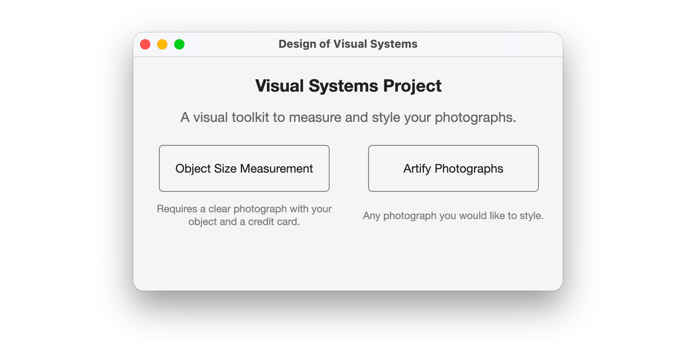 

### Feature 1: Object Size Measurement

This program measure the physical dimensions of an object planced next to a standard credit card. The credit card serves as a fixed size reference, using its know dimensions of 85.6 × 54 mm.

**🌠 Image Processing**

Image is pre-processed using techniques learning in Labs: Contrast enhancement using `imadjust`, Gaussian filter to remove the noise, Otsu's method and morphological cleanups (`imopen`, `imclose`, `imfill`) to separate the objects from the background.

**💳 Credit Card Detection**

Connected regions are analysed using `regionprops` of `cc` element of the image. The card is identified by its aspect ratio with tolerance to slight distortion. Also its rectangular solidity is determined by extent value threshold of 0.88.

**📏 Corner Detection and Straightening**

The card region is rotated using the `Orientation` property, and then mapped using Harris corner detection. Harris corner detection is applied and then four corners are selected geometrically from each quadrant. Additional geometric logic deals with round card corners and ensures that staircase noises are not selected.

**🧸 Object Measurement**  

The remaining non-card region in the binarised image is taken as the object. The dimensions are converted to mm/cm metric, based on the mapped scale of credit card. Its bounding box dimension is derived from `MajorAxisLength` and `MinorAxisLength` on the straightened mask. Perimeter and area are measured directly from the binarised image. 

Full iterative processes can be accessed in `/Challenges/test` folder. 

---

### Feature 2: Artify Photographs

This program allows users to explore digital image processing and art interactively. It transforms standard images into three artistic styles: Comic Book, Pointillism, and Stained Glass. 

**User Flow**
1. Upload any standard image file
2. The system automatically extracts a color theme palette using K-means clustering. You can set the number of clusters (5, 7, or 10) to control the level of color abstraction
3. Choose the art style from the dropdown menu
4. Use the slider to control style-specific details like stroke thickness, dot size, or shard density
5. Click any swatch in the generated color palette to render the image in grayscale except for the chosen color cluster 

**📔 Comic Book Style**
This style focuses on bold colours and heavy outlines. To achieve this, the system converts the image to grayscale and applies Canny edge detection. To simulate a hand-drawn aesthetic, morphological opening (bwareaopen) is applied to remove noise and stray pixels and dilation (imdilate) with a disk-shapred structuring element thicken the detected edges based on the user-defined thickness parameter. These outlines are then converted to pure black and overlaid onto the color-quantised image. 

**🟡 Pointillism Style**
The Pointillism style is inspired by the Neo-Impressionism movement, it replaces continuous gradients with a dense field of ~120 000 distinct dots. To avoid a rigid "computer-generated" look, dot locations are randomised using randi and colors are subjected to a slight colorShift. Color dots are painted with varying sizes (5:3:2 size ratio) to simulate an artist's transition between broard background strokes and fine detail strokes.

**🪟 Voronoi Stained Glass Style**
The Voronoi stained glass style features coloured glass pieces arranged in patterns using Voronoi tessellation. It divides the image into regions based on proximity to "seed" points. Calculating millions of Euclidean distances is computationally expensive, so the original image  is scaled down to a maxDim of 1000 pixelss for the Voronoi math, and scales back up using imresize with the nearest neighbor interpolation. The polygon boundaries are detected and a charcoal-colored dilation is applied to thicken them so they look like the lead strips that seperate pieces of stained glass.

## Setup & Requirements

* **Required toolbox and equipment:** Image Processing Toolbox, Computer Vision Toolbox

* Run `launcher.m` in Challenges folder.

## Results & Demonstrations

| Example 1        | Example 2      | 
| :---:             | :---:             | 
| | |

The left image demonstrates the ability to suppress the light background noise and detect the card and the object. The right image demonstrates the **multi-object detection** and the ability to **handle the rotation**. More than one non-card objects are inspected using tabs on the right panel.

| Surfboard Comic Style | Surfboard Pointillism | Surfboard Glass Style |
| :---: | :---: | :---: |
|  |  | 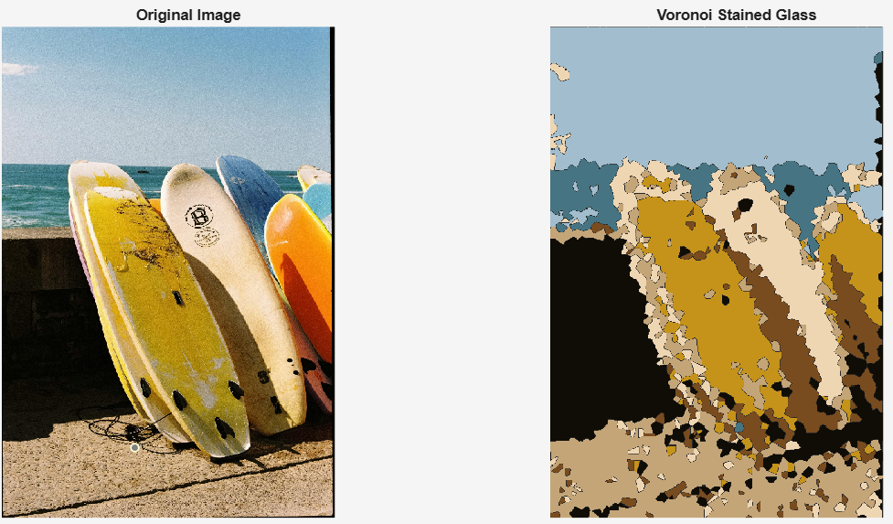 |

| City View Comic Style | City View Pointillism | City View Glass Style |
| :---: | :---: | :---: |
| 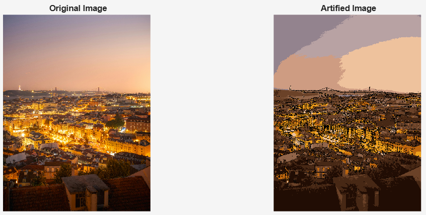 | 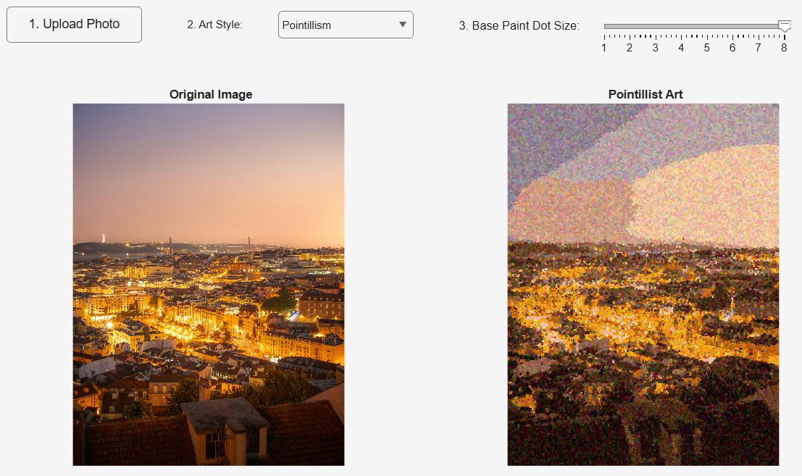 | 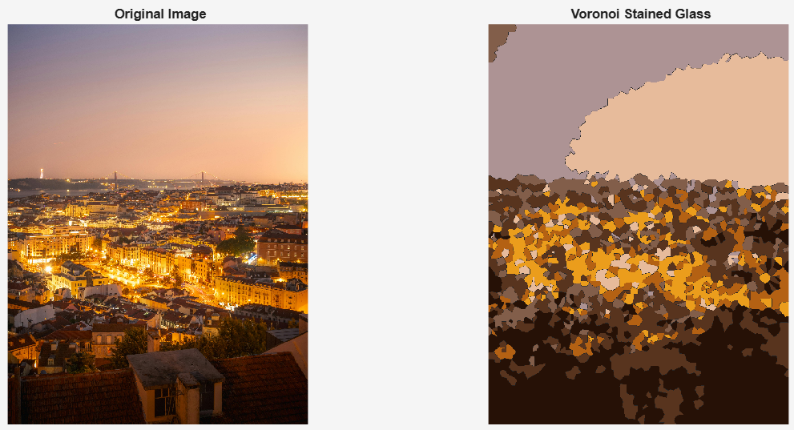 |

 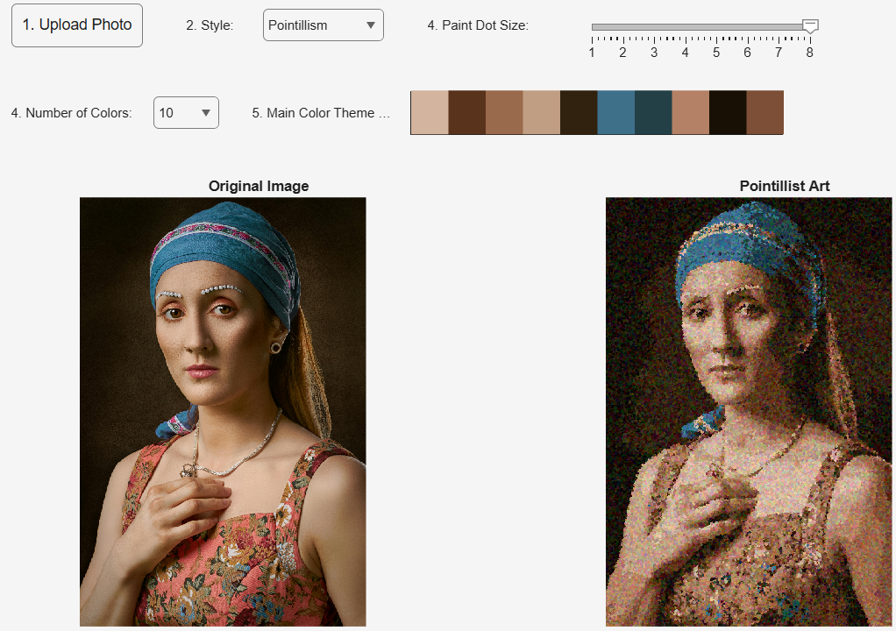 

Different type of images are tested to see its ability to transform the art style.

| Surfboard Comic (Size 2) | Surfboard Comic (Size 7) | Surfboard Pointillism (Size 2) | Surfboard Pointillism (Size 8) |
| :---: | :---: | :---: | :---: |
|  | 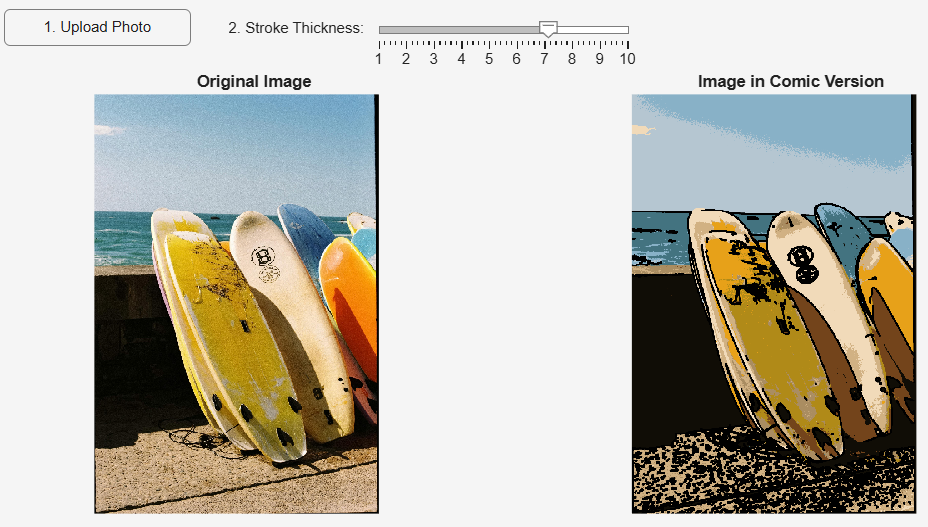 | 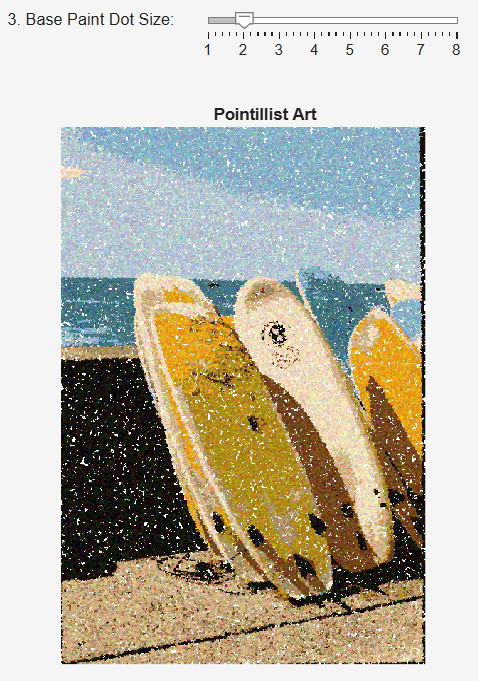 | 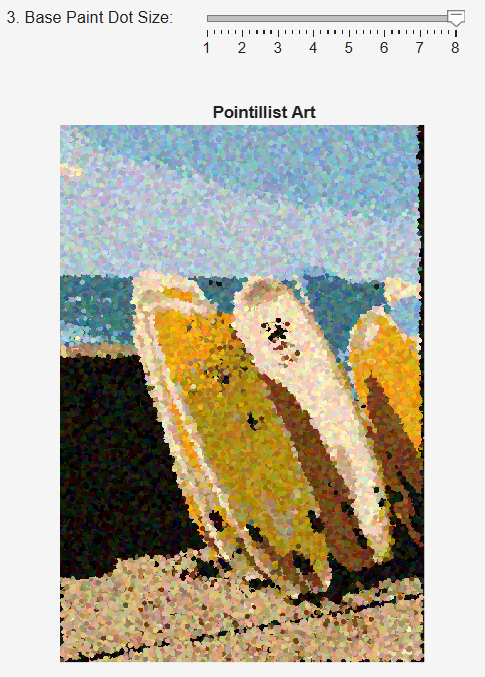 |

| City View Glass (Density 1) | City View Glass (Density 8) |
| :---: | :---: |
| 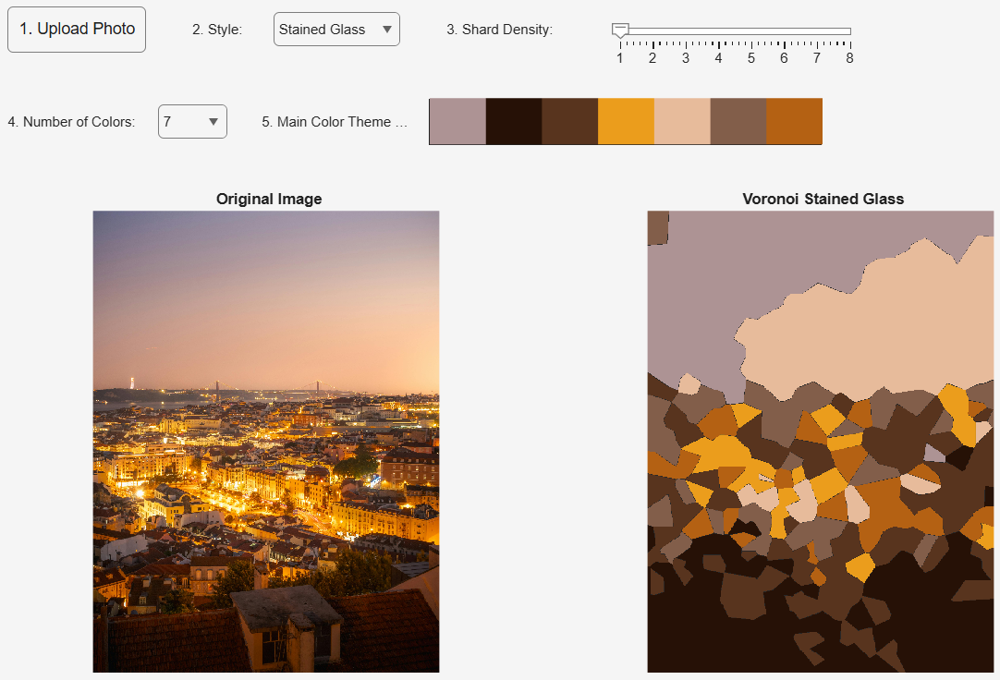 |  |

Changing the stroke thickness, dot sizes, and shard densities result in images with varying details and levels of abstraction. 

 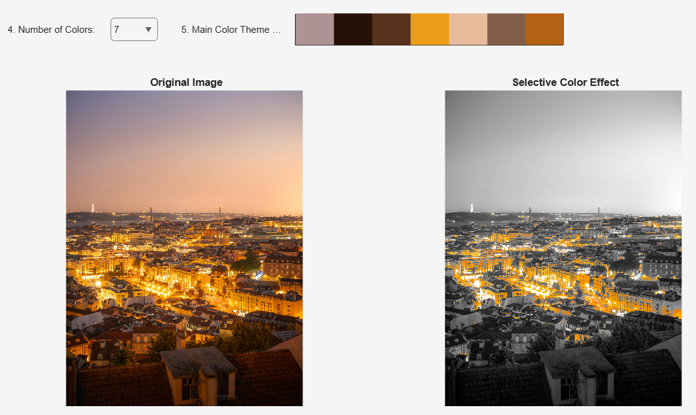 

Click on one of the colours in the main colour theme highlights that color.

## Evaluations

### Feature 1 Evaluation

**Image correction:**
* Handles card rotation in any orientation wihtout manual input
* ‼️ Limitation on severely angled photographs. Attempt on homography extension as shown below, to be automatically applied when initial card detection fails. However, it generates unstable result, or misidentifies the card due to distorted ratio.

| Homography Attempt 1        | Homography Attempt 2      | 
| :---:             | :---:             | 
| | |

**Environment dependencies:**
* Reliably detects a credit card and measures the object under controlled conditions: assumes well-lit image with clear background
* ‼️ However, the performance would degrade on noisy, dark, or low-contrast backgrounds as Otsu's method might fail to separate objects cleanly

### Feature 2 Evaluation

**Reducing Noise:**
The texture of an image can introduce noise, which is often emphasised by the edge detector. For example, the surfboard image has a grainy texture which led to noise.

 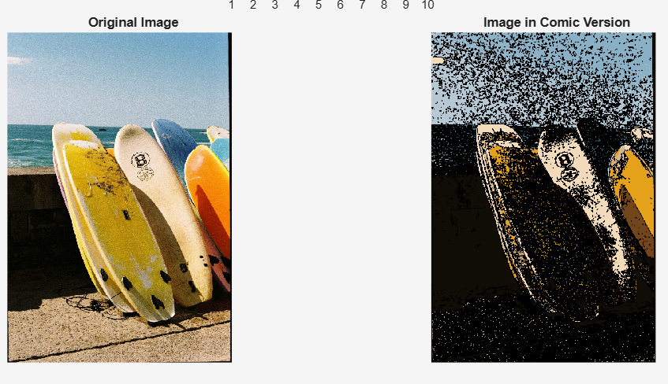 

An imguided filter is applied to smooth the image while preserving sharp edge structures. To prevent faint edges being detected by the Canny edge detector and clutter the art, the default threshold is manually adjusted (strictThresh = defaultThres * 2.5), so that only primary outlines are drawn.

**Making image more Painting-like:**
Digital pixels are too perfect for art. To make the results more similar to real-life painting, K-means clustering helps identify the main colors, which replicates how a painter mixes a limited palette rather than using the infinite gradients of a raw digital file.

| Windsurf with exact pixel colors        | Windsurf with k-means colors      | 
| :---:             | :---:             | 
|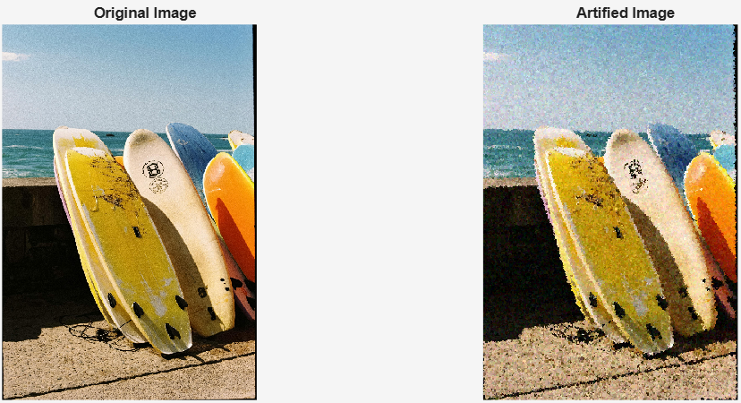 | |

For the Pointillism style, real life artists have varying paint sizes and the colors and location of those dots are often non-uniform. Therefore the locations and the colors of the dots are slightly randomised. The size of the dots is different too in order to give a more organic feel. 
In the Voronoi stained glass style, circshift function is used to slightly offset the shards to mimick the minor misalignments found in physical glasswork.

**Limitations**

High-resolution images (4K+) significantly increase render times for the Pointillism and Voronoi styles due to the amount of point in polygon and randomisation calculations. In addition, the Voronoi method uses random seeds, which means it distributes shards uniformly across the image where in a real stained-glass window, an artist would put small, detailed pieces around a face and larger pieces in the sky. The current system treats the sky and the subject with the same "shard density".

## Individual Reflection

_Each member provides a person statement declaring what you personally have contributed to the project, a reflection section on what you have learned, reasons for your design decisions, mistakes you have made and what you would do differently if you were to do this again._

### Yujeong Seo:

I took responsibility for **Lab 6** and **Challenge 1: object size measurement** using credit card. Through this module and project, I learned how we process the visual elements is underpinned by mathematical operations, such as image intensity transforms, spatial filtering, and morphological operations. Also, I observed how small decisions and combination of techniques can produce significantly different results for same images.

For the design, I prioritised communicating the decision process intuitively rather than just outputting the numerical measurement results. It included decisions like marking detected card corners and displaying both the cropped binarised and colour images to support the logic. 

After struggling with Canny edge detection + morphological closing, I switched the method to contrast enhancement followed by Otsu binarisation, which proved more robust in separating the objects. However, as this approach would fail for indifferent brightnesses, I would explore a more reliable image processing method if I would do it again. More clearer segmentation of objects would also lay better groundwork for extending the system to live webcam measurement, which was discarded due to the difficulty of maintaining a controlled background real time.

### Gabriela Lee:

I was working on **Lab 5** and **Challenge 4: Artify photographs**. I also attempted most of the challenges in Lab 5. My design focused on visual intuition and realism. I focused on identifying the key features of real paintings, such as the varied brush sizes and replicate them through algorithm logic.

I have learnt that tuning optimal thresholds for edge detectors is as much an art as a science, different lighting conditions can signficantly changes it. In addition, implementing robust edge detection is significantly harder than I thought, especially in images with overlapping subjects and low-contrast boundaries. 

I also learnt that the algorithm efficiency really matters in image processing. Time complexity can increase hugely when the image has high resolution. I have made the mistake of using nested for loops for pixel-level calculations and not compressing the iamge for complex comptuation. This led to several UI freezes. I also attempted to implement a 3D relief graph; however, I eventually scrapped this feature, realizing that while technically interesting, it added little functional or aesthetic value to the user’s artistic experience 

If I were to imrprove this project, I would implement advanced image compression to enhance performance further. I would also use a CNN to perform Neural Style Transfer so that the system can learn specific artistic styles with image database and applies them into original image.